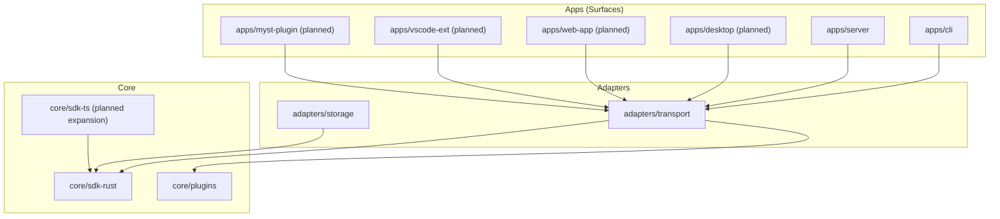
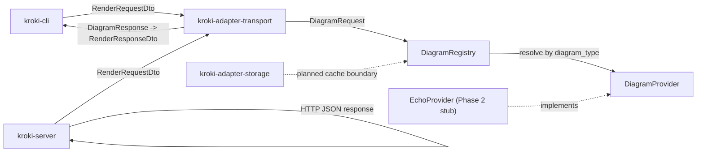
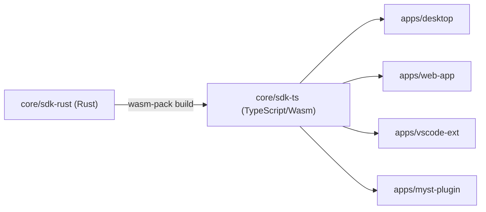
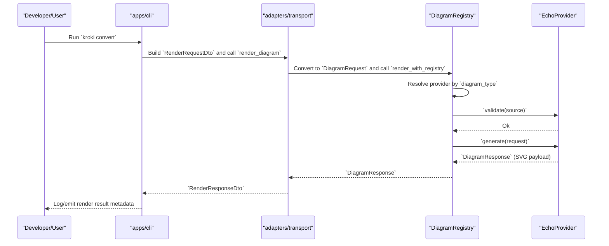
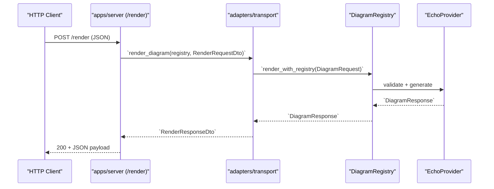

# Architecture Overview

## Design Philosophy

kroki-rs-nxt follows the **Hexagonal Architecture** (Ports & Adapters) pattern. This separates pure domain logic from infrastructure concerns, enabling multiple interaction surfaces to share the same core engine.



### Dependency Direction Rule

**`apps → adapters → core`**

Core MUST NEVER depend on an App or Adapter. Adapters MUST NEVER depend on an App.

---

## Architecture State (Current vs Target)

### Current Repository State (Phase 2 Bootstrap)

- `core/sdk-rust` is scaffolded with base modules (`ports`, `providers`, `services`, `config`, `error`, `utils`).
- `adapters/storage` and `adapters/transport` are scaffolded as bootstrap baseline crates.
- `apps/cli` and `apps/server` compile with placeholder runtime entry points.
- `apps/desktop`, `apps/web-app`, and `apps/vscode-ext` have bootstrap baseline packages and are ready for active feature implementation.

### Target State (Phases 3-5)

- Provider implementations are migrated in capability slices (Command, Browser, Pipeline, Plugin).
- Adapters become production-ready with HTTP handlers, middleware, caching integration, and observability.
- Additional surfaces (Desktop, Web, VS Code) are activated and consume shared core logic through `core/sdk-ts`.

---

## Layers

### Responsibility Summary

| Layer | Owns | Does Not Own |
|-------|------|--------------|
| Apps | User entry points, app lifecycle, surface UX/API endpoints | Core business rules, provider internals |
| Adapters | IO boundaries, DTO mapping, protocol translation, middleware | Domain policy decisions |
| Core | Domain contracts, provider orchestration, business semantics | Transport concerns, app runtime concerns |

### Core (`core/`)

Pure domain logic with zero infrastructure dependencies. Defines interface traits (ports) that adapters implement.

| Crate | Purpose |
|-------|---------|
| `core/sdk-rust` (`kroki-core`) | Primary business logic: traits, domain models, providers, config |
| `core/plugins` (`kroki-plugins`) | Plugin discovery, loading, and lifecycle management |
| `core/sdk-ts` | Wasm/FFI bindings exposing Rust domain logic to TypeScript surfaces |

### Adapters (`adapters/`)

Concrete implementations of core traits for specific technologies.

| Crate | Purpose |
|-------|---------|
| `adapters/storage` (`kroki-adapter-storage`) | Filesystem cache (SHA256-keyed), future DB backends |
| `adapters/transport` (`kroki-adapter-transport`) | HTTP handlers (Axum), IPC for Tauri, CLI dispatch |

### Apps (`apps/`)

Entry points that compose Core and Adapters into runnable applications.

| App | Stack | Description |
|-----|-------|-------------|
| `apps/cli` (`kroki-cli`) | Rust (Ratatui TUI) | Interactive terminal UI for diagram conversion |
| `apps/server` (`kroki-server`) | Rust (Axum) | HTTP API server with auth, rate limiting, metrics |
| `apps/desktop` | Tauri (Rust + Lit/TS) | Native desktop app with embedded web UI (planned) |
| `apps/vscode-ext` | TypeScript | VS Code extension for in-editor diagram preview (planned) |
| `apps/web-app` | Lit + TypeScript | Standalone web dashboard (planned) |
| `apps/myst-plugin` | TypeScript | MyST plugin surface for documentation-native rendering workflows (planned) |

### Shared (`shared/`)

Cross-stack resources used by multiple surfaces.

| Directory | Purpose |
|-----------|---------|
| `shared/design-system` | Shared Lit web components and CSS design tokens |
| `shared/scripts` | Global CI/CD and build scripts |

### Component and Interface View



---

## Core Domain Model

The domain model is extracted from kroki-rs and refined for hexagonal architecture boundaries.

### DiagramProvider (Port)

The central abstraction. Every diagram type implements this trait.

```rust
#[async_trait]
pub trait DiagramProvider: Send + Sync {
    /// Validate the diagram source before generation.
    fn validate(&self, source: &str) -> DiagramResult<()>;

    /// Generate a diagram from source in the specified format.
    async fn generate(&self, request: &DiagramRequest) -> DiagramResult<DiagramResponse>;

    /// Return the list of output formats this provider supports.
    fn supported_formats(&self) -> &[OutputFormat];
}
```

### Provider Categories

| Category | Description | Examples |
|----------|-------------|---------|
| **Command** | Wraps CLI tools via subprocess | Graphviz (dot), D2, Ditaa, Wavedrom, Excalidraw |
| **Browser** | Evaluates JS in headless Chrome (CDP) | Mermaid, BPMN |
| **Pipeline** | Multi-step conversion chains | Vega-Lite → Vega → SVG |
| **Plugin** | External subprocess via plugin protocol | User-defined custom tools |

### DiagramRegistry

Central registry for provider discovery and lookup.

```rust
pub struct DiagramRegistry {
    providers: HashMap<String, Arc<dyn DiagramProvider>>,
}

impl DiagramRegistry {
    pub fn register(&mut self, name: &str, provider: Arc<dyn DiagramProvider>);
    pub fn get(&self, name: &str) -> Option<Arc<dyn DiagramProvider>>;
    pub fn known_types(&self) -> Vec<String>;
}
```

### Domain Types

```rust
pub struct DiagramRequest {
    pub source: String,
    pub diagram_type: String,
    pub output_format: OutputFormat,
    pub options: DiagramOptions,
}

pub struct DiagramResponse {
    pub data: Vec<u8>,
    pub content_type: String,
    pub duration_ms: u64,
}

pub enum OutputFormat {
    Svg,
    Png,
    WebP,
    Pdf,
}

pub enum DiagramError {
    ValidationFailed(String),
    ToolNotFound(String),
    ExecutionTimeout { tool: String, timeout_ms: u64 },
    ProcessFailed(String),
    UnsupportedFormat { format: String, provider: String },
    Io(std::io::Error),
    Internal(String),
}
```

For the frozen Phase 2 baseline contract and change-control rules, see:
- [Core Contract Boundaries (v0.1.0-alpha)](#kroki-rs-nxt.developer-guide.core-contracts)

---

## Cross-Cutting Concerns

### Configuration

- **Runtime config** (`kroki.toml`): server settings, tool paths, timeouts, auth, rate limits
- **Build config** (`devflow.toml`): workflow orchestration, CI targets, extensions
- **Environment overrides**: `KROKI_<TOOL>_BIN`, `KROKI_<TOOL>_TIMEOUT`, etc.

### Observability

- **Structured logging**: `tracing` with configurable log levels and env-filter
- **Metrics**: `metrics` crate with Prometheus exporter
- **Per-provider tracking**: request count, duration, payload size, error types

### Browser Pool

- Headless Chrome via CDP (feature-gated: `native-browser`)
- Connection pool with configurable size
- Context reuse with TTL for memory management
- Health metrics: active contexts, idle slots

### Caching

- **Key**: SHA256 hash of (diagram_type, format, source, options)
- **Storage**: filesystem (configurable directory), extensible to other backends
- **Strategy**: check cache → generate → store result

---

## Wasm/FFI Bridge (`core/sdk-ts`)

TypeScript surfaces (desktop frontend, web-app, vscode-ext, myst-plugin) access core domain logic through Wasm bindings generated from `core/sdk-rust`.



This ensures business logic is written once in Rust and shared across surfaces.

---

## Runtime Flow Diagrams

### CLI Convert Flow (Phase 2 Vertical Slice)



### Server Render Flow (`POST /render`)



---

## Architectural Decision Records

Key decisions are documented in [Design Decisions (ADRs)](#kroki-rs-nxt.developer-guide.adr.index):

| ADR | Decision |
|-----|----------|
| [ADR-001](#kroki-rs-nxt.adr.0001) | Hexagonal architecture with apps/adapters/core layering |
| [ADR-002](#kroki-rs-nxt.adr.0002) | Single monorepo for all surfaces (split only when evidence justifies) |
| [ADR-003](#kroki-rs-nxt.adr.0003) | devflow v0.2.0 as workflow orchestration from day one |
| [ADR-004](#kroki-rs-nxt.adr.0004) | Wasm bridge for Rust-to-TypeScript shared logic |
| [ADR-005](#kroki-rs-nxt.adr.0005) | Ratatui for CLI TUI (upgrade from clap-only) |
| [ADR-006](#kroki-rs-nxt.adr.0006) | Test structure and taxonomy for maintainable multi-surface development |
