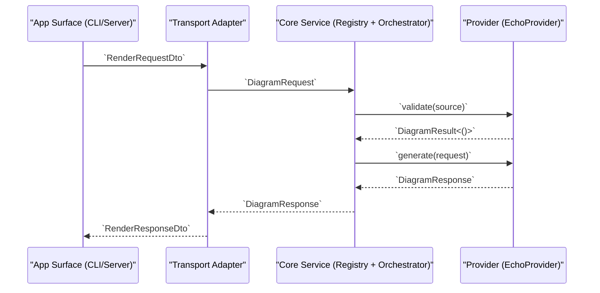

# Core Contract Boundaries (v0.1.0-alpha)

## Purpose

This document freezes the Phase 2 baseline request/response/error contract boundaries used between:

- app surfaces (`apps/cli`, `apps/server`)
- transport adapter (`adapters/transport`)
- core domain (`core/sdk-rust`)

These boundaries are treated as stable for Phase 3 migration batches. Changes require explicit roadmap + execution updates.

## Contract Scope

The frozen boundary covers:

- `DiagramRequest`
- `DiagramOptions`
- `DiagramResponse`
- `OutputFormat`
- `DiagramError`
- `DiagramProvider` trait behavior contract

Source of truth:

- `core/sdk-rust/src/ports.rs`
- `core/sdk-rust/src/error.rs`
- `core/sdk-rust/src/services.rs`

## Request Contract

`DiagramRequest` fields:

- `source: String`
- `diagram_type: String`
- `output_format: OutputFormat`
- `options: DiagramOptions`

`DiagramOptions` fields:

- `font_urls: Vec<String>`
- `timeout_ms: Option<u64>`

Behavioral contract:

- `source` must be non-empty for a valid request.
- `diagram_type` must match a registry provider key.
- `output_format` must be supported by the resolved provider.
- `options` is optional and defaults to empty behavior in Phase 2.

## Response Contract

`DiagramResponse` fields:

- `data: Vec<u8>`
- `content_type: String`
- `duration_ms: u64`

Behavioral contract:

- `data` contains the full rendered output payload.
- `content_type` must match output format semantics.
- `duration_ms` is provider execution duration in milliseconds.

## Output Format Enum

Frozen `OutputFormat` variants:

- `Svg`
- `Png`
- `WebP`
- `Pdf`

Compatibility note:

- New variants are additive and allowed in future phases.
- Renaming or removing existing variants is a breaking change and requires a migration note.

## Error Contract

Frozen `DiagramError` variants:

- `ValidationFailed(String)`
- `ToolNotFound(String)`
- `ExecutionTimeout { tool: String, timeout_ms: u64 }`
- `ProcessFailed(String)`
- `UnsupportedFormat { format: String, provider: String }`
- `Io(std::io::Error)`
- `Internal(String)`

Behavioral contract:

- Validation failures use `ValidationFailed`.
- Missing provider/tool resolution uses `ToolNotFound`.
- Unsupported output format uses `UnsupportedFormat`.
- Adapter/app surfaces may map these to transport-specific errors, but must preserve meaning.

## Provider Trait Contract

`DiagramProvider` requires:

- `validate(&self, source: &str) -> DiagramResult<()>`
- `generate(&self, request: &DiagramRequest) -> DiagramResult<DiagramResponse>`
- `supported_formats(&self) -> &[OutputFormat]`

Behavioral rules:

- `validate` is fast and deterministic.
- `generate` assumes input already validated, but may still return validation errors if required.
- `supported_formats` is treated as provider capability contract for routing and prechecks.

## Phase 2 Vertical Slice Baseline

Phase 2 closes with a minimal vertical slice implemented and tested:

- Provider stub: `EchoProvider` in `core/sdk-rust/src/providers.rs`
- Core orchestration: `render_with_registry` in `core/sdk-rust/src/services.rs`
- Transport mapping: `RenderRequestDto`/`RenderResponseDto` + `render_diagram` in `adapters/transport/src/lib.rs`
- App usage:
  - CLI convert path uses `run_convert_bootstrap`
  - Server `/render` route executes through adapter and core registry

### Contract Flow Sequence

## Change Control for Phase 3

For `v0.1.0-alpha`, this contract is frozen with the following rules:

- Additive fields are allowed only when backward-compatible defaults exist.
- Field removals/renames are blocked until Phase 3 parity planning explicitly approves them.
- Error meaning must remain stable even if transport mapping evolves.
- Contract changes must update:
  - this document
  - roadmap Phase 3 backlog
  - execution tracker change log
