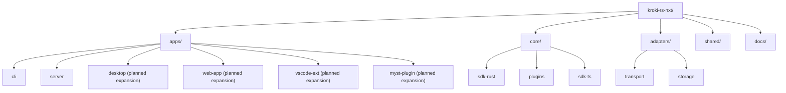

# Repository Structure Guide

This document describes the current monorepo layout and the intended expansion path. Where relevant, sections call out whether an item is active now or planned for later phases.

## Directory Layout

```
kroki-rs-nxt/
│
├── apps/                           # Executable surfaces
│   ├── cli/                        # Rust CLI (active)
│   ├── server/                     # Rust server (active)
│   ├── desktop/                    # Tauri app baseline package (planned feature expansion)
│   ├── myst-plugin/                # MyST plugin baseline package (planned feature expansion)
│   ├── vscode-ext/                 # VS Code extension baseline package (planned feature expansion)
│   └── web-app/                    # Web dashboard baseline package (planned feature expansion)
│
├── core/                           # Pure domain logic & SDKs
│   ├── sdk-rust/                   # Core business logic and ports
│   ├── plugins/                    # Plugin framework crate
│   └── sdk-ts/                     # TS multi-package workspace (active bootstrap)
│       └── packages/
│           ├── runtime-wasm/       # Runtime contract boundary + wasm bridge stubs
│           ├── ui-tokens/          # Shared tokens/theme primitives
│           ├── ui-components/      # Shared Lit components
│           ├── host-adapters/      # Host integration boundaries
│           └── app-playground/     # Composed playground app shell
│
├── adapters/                       # Infrastructure implementations
│   ├── storage/                    # Storage adapter crate
│   └── transport/                  # Transport adapter crate
│
├── shared/                         # Cross-stack resources
│   ├── design-system/              # Design system scaffold
│   └── scripts/                    # Shared scripts scaffold
│
├── docs/                           # MyST documentation
│   ├── myst.yml                    # MyST configuration
│   ├── toc.yml                     # Documentation table of contents
│   ├── user-guide/                 # User-facing documentation
│   ├── developer-guide/            # Developer-facing documentation
│   │   ├── 01-getting-started/
│   │   ├── 02-design/
│   │   ├── 03-development/
│   │   ├── 04-roadmap/
│   │   ├── 06-execution/
│   │   └── 10-resources/
│   └── reference.md
│
├── Cargo.toml                      # Root Rust workspace
├── package.json                    # Root Node workspace manifest
├── pnpm-workspace.yaml             # pnpm workspace member list
├── devflow.toml                    # devflow workflow configuration
├── CLAUDE.md                       # Project-specific assistant instructions
├── LICENSE                         # MIT license
└── README.md                       # Project overview
```

## Structure Diagram



---

## Workspace Membership

### Rust Workspace (`Cargo.toml`)

| Member Path | Package Name | Status | Layer |
|-------------|-------------|--------|-------|
| `core/sdk-rust` | `kroki-core` | Active | Core |
| `core/plugins` | `kroki-plugins` | Active | Core |
| `adapters/storage` | `kroki-adapter-storage` | Active | Adapter |
| `adapters/transport` | `kroki-adapter-transport` | Active | Adapter |
| `apps/cli` | `kroki-cli` | Active | App |
| `apps/server` | `kroki-server` | Active | App |
| `apps/desktop/src-tauri` | `kroki-desktop` | Planned (commented in root workspace) | App |

### pnpm Workspace (`pnpm-workspace.yaml`)

| Member Path | Package Name | Status | Layer |
|-------------|-------------|--------|-------|
| `core/sdk-ts` | `@kroki/sdk-ts-workspace` | Active nested workspace | Core |
| `core/sdk-ts/packages/runtime-wasm` | `@kroki/runtime-wasm` | Active bootstrap package | Core |
| `core/sdk-ts/packages/ui-tokens` | `@kroki/ui-tokens` | Active bootstrap package | Core |
| `core/sdk-ts/packages/ui-components` | `@kroki/ui-components` | Active bootstrap package | Core |
| `core/sdk-ts/packages/host-adapters` | `@kroki/host-adapters` | Active bootstrap package | Core |
| `core/sdk-ts/packages/app-playground` | `@kroki/app-playground` | Active bootstrap package | Core |
| `apps/desktop/src` | `@kroki/desktop-ui` | Bootstrap baseline package | App |
| `apps/myst-plugin` | `@kroki/myst-plugin` | Bootstrap baseline package | App |
| `apps/vscode-ext` | `@kroki/vscode` | Bootstrap baseline package | App |
| `apps/web-app` | `@kroki/web-app` | Active Vite surface bootstrap | App |
| `shared/design-system` | `@kroki/design-system` | Bootstrap baseline package | Shared |

---

## Naming Conventions

### Rust Crates

Pattern: `kroki-<qualifier>`

| Crate | Description |
|-------|-------------|
| `kroki-core` | Core domain logic and ports |
| `kroki-plugins` | Plugin framework |
| `kroki-adapter-storage` | Storage adapter implementations |
| `kroki-adapter-transport` | Transport adapter implementations |
| `kroki-cli` | CLI binary |
| `kroki-server` | Server binary |
| `kroki-desktop` | Tauri desktop binary (planned) |

### TypeScript Packages

Pattern: `@kroki/<name>`

| Package | Description |
|---------|-------------|
| `@kroki/sdk-ts-workspace` | Nested workspace orchestration package for sdk-ts modules |
| `@kroki/runtime-wasm` | Runtime request/response contracts and wasm bridge interface |
| `@kroki/ui-tokens` | Shared theme tokens and palette primitives |
| `@kroki/ui-components` | Shared Lit UI component modules |
| `@kroki/host-adapters` | Host adapter interfaces and implementations |
| `@kroki/app-playground` | Composed playground app package |
| `@kroki/desktop-ui` | Tauri Lit frontend |
| `@kroki/myst-plugin` | MyST plugin integration surface |
| `@kroki/vscode` | VS Code extension |
| `@kroki/web-app` | Web dashboard |
| `@kroki/design-system` | Shared UI components |

---

## Folder Responsibilities

| Directory | Responsibility | Main Stack |
|-----------|---------------|------------|
| `apps/` | User-facing applications and interaction surfaces | Polyglot |
| `core/` | Domain logic, business rules, and SDK definitions | Rust |
| `adapters/` | Infrastructure implementations (cache, transport, IO boundaries) | Rust |
| `shared/` | Cross-surface assets, scripts, and design primitives | TS/CSS |
| `docs/` | Product, architecture, and execution documentation | Markdown |

Responsibility notes:
- `apps/` coordinates user-facing workflows and calls adapter boundaries.
- `adapters/` translates app IO to core contracts and returns transport-safe responses.
- `core/` owns domain contracts and orchestration; it does not depend on apps/adapters.
- `shared/` contains reusable front-end assets and cross-surface tooling, not domain logic.

---

## Rules of Engagement

1. **Dependency Direction**: `apps -> adapters -> core`.
2. **Configuration Locality**: Keep environment-specific config inside each app package.
3. **Shared Logic**: Rust/TS shared domain logic should be exposed through `core/sdk-ts`.
4. **Testing Strategy**:
   - Unit tests: in-module (`#[cfg(test)]` for Rust, co-located `.test.ts` for TS)
   - Integration tests: `<crate>/tests/`
   - E2E tests: `apps/<app>/tests/`
   - Contract tests: validate adapter implementations against core trait contracts
5. **Execution Tracking**: Track phase work and delivery status in `docs/developer-guide/06-execution/`.
