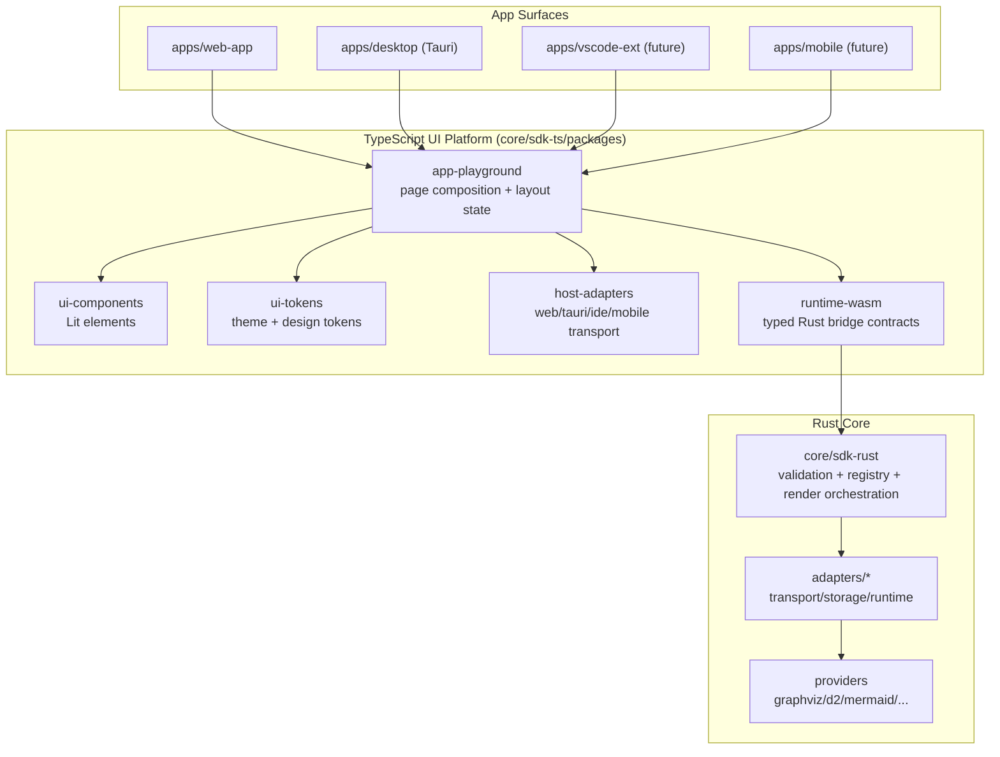
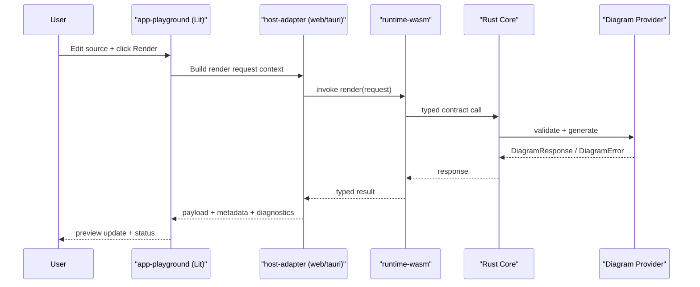
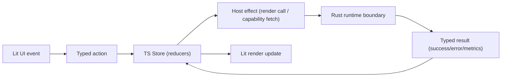

# UI Platform and Playground Architecture

## Intent

Define a reusable UI platform for Kroki-rs-nxt that:

- delivers a professional playground experience (D2-style editor layout)
- reuses the same Lit component modules across web and desktop first
- remains extensible for mobile and IDE/plugin surfaces later
- keeps rendering/domain logic in Rust (WASM/FFI) and UI in Lit

This proposal uses:

- **pnpm** for workspace package management
- **Vite** for fast ESM-native development and bundling
- **Lit** for UI components and composable shells
- **Rust core** exposed through explicit TypeScript/WASM contracts

---

## Why This Shape

The main architectural constraint is multi-surface reuse without UI divergence.

- If UI is implemented directly inside each app surface, style and behavior drift quickly.
- If all logic is pushed to TS, domain parity with Rust degrades over time.
- If all UI is in one app package, host-specific concerns (web vs tauri vs webview) leak into components.

The proposed structure isolates:

- **UI primitives and tokens** (shared and host-agnostic)
- **Playground composition** (shared app module)
- **Host adapters** (web/tauri/IDE messaging specifics)
- **Rust bridge contracts** (typed boundary to core logic)

---

## Proposed Package Topology

Target location under `core/sdk-ts`:

```text
core/sdk-ts/
  packages/
    runtime-wasm/       # Rust/WASM bridge + core request/response contracts
    ui-tokens/          # CSS variables, theme system, motion primitives
    ui-components/      # Reusable Lit components (no host-specific APIs)
    app-playground/     # Composed editor application shell
    host-adapters/      # host-web, host-tauri, future host-vscode, host-mobile
```

Surface consumption:

- `apps/web-app` imports `app-playground` + `host-adapters/web`
- `apps/desktop` imports `app-playground` + `host-adapters/tauri`
- future IDE/mobile surfaces import the same UI and swap host adapter

---

## Layered Architecture



---

## Playground UX Composition

### Layout target

Three-pane editor workflow inspired by D2 playground ergonomics:

1. **Left pane**: examples, diagram type, rendering options
2. **Center pane**: source editor
3. **Right pane**: output preview, diagnostics, export controls

Top bar:

- render action
- output format
- theme switch
- status indicators (latency, error state, runtime mode)

### Lit component map

- `<kroki-shell>`
- `<kroki-topbar>`
- `<kroki-sidebar>`
- `<kroki-editor-pane>`
- `<kroki-preview-pane>`
- `<kroki-status-bar>`
- `<kroki-toast>`

All components consume token package CSS custom properties; no hard-coded surface colors.

---

## Runtime Flow (Render Path)



Error path requirements:

- preserve domain error categories from Rust
- map host/runtime failures separately (network, bridge, timeout)
- show deterministic UI diagnostics (no opaque failures)

---

## State Management Model (UI + Core)

State is split by ownership to avoid duplicated logic and drift.

### Ownership boundaries

- **UI state (TypeScript/Lit)**:
  - editor text, cursor/selection, pane layout, theme, active example
  - request lifecycle (`idle | running | success | error | cancelled`)
  - transient diagnostics and UX hints
- **Domain/render state (Rust core)**:
  - request validation and normalization
  - provider capability resolution and execution decisions
  - render result contracts, error categories, and metadata

Rule: UI never re-implements domain validation logic that is already part of Rust contracts.

### Store taxonomy

- **App session store**: top-level shell state (theme, layout, selected provider)
- **Document store**: current source, dirty state, and revision id
- **Render job store**: in-flight request id, cancellation token, latency/status
- **Capability store**: cached provider metadata from runtime

Keep stores reducer/event-based with immutable snapshots to support deterministic re-render and time-travel style debugging when needed.

### Unidirectional data flow



### Concurrency and cancellation rules

- Assign a monotonic `revision_id` to each render request.
- Only latest revision can update preview (drop stale completions).
- Cancel prior in-flight request when a new render starts.
- Debounce auto-render by diagram type profile (shorter for fast providers, longer for browser-heavy providers).

### Persistence rules

- Persist only user-facing workspace state (editor content, selected options, layout) in host storage.
- Do not persist transient runtime internals (in-flight tokens, temporary diagnostics).
- Version persisted schemas with explicit migration hooks (`schema_version`).

### Error and status model

- Preserve Rust domain error kind as canonical classification.
- Map host/runtime failures to separate UI categories (`host_error`, `bridge_error`, `timeout`, `cancelled`).
- Include user-actionable diagnostics first, technical detail second.

---

## Host Adapter Contract

Each host adapter implements a small contract:

- `render(request): Promise<RenderResult>`
- `getCapabilities(): Promise<Capabilities>`
- optional `saveFile`, `openFile`, `clipboard` actions

Rules:

- UI components do not import host-specific APIs directly.
- Host adapter is injected by surface bootstrap.
- Host adapters convert host specifics into stable app-playground contracts.

This prevents web/tauri/vscode logic from leaking into shared Lit modules.

---

## Styling and Design System Alignment

Use `ui-tokens` as the only source of truth for:

- palette and semantic color roles
- type scale and spacing scale
- elevation, borders, blur, glow primitives
- motion tokens (durations/easings)

Component packages should consume tokens only.

This is required to enforce your style-guide parity across all surfaces.

---

## Build and Toolchain Strategy

### pnpm + Vite rationale

- Lit is ESM-native; Vite gives near-zero-config fast dev server and optimal HMR.
- pnpm workspace dedup keeps TS package installs fast and deterministic.
- Vite library mode supports clean reusable package outputs for `ui-components` and `app-playground`.

### Rust integration strategy

- Keep rendering and complex logic in Rust.
- Expose stable TS runtime contract through `runtime-wasm`.
- Treat runtime bridge API as a versioned boundary (avoid ad-hoc method growth).

---

## Risks and Mitigations

| Risk | Impact | Mitigation |
|------|--------|------------|
| Host adapter leakage into UI components | Poor reuse across surfaces | Enforce host adapter boundary + lint rule for forbidden imports |
| UI token bypass (hardcoded styles) | Style drift across apps | Token-only policy + review checklist |
| WASM contract churn during rapid iteration | Surface integration breaks | Version runtime contract and batch incompatible changes |
| Component over-generalization too early | Delivery slowdown | Start with concrete playground components, generalize after 2 surfaces |
| Performance regressions in large diagrams | UX degradation | Add render debounce, cancellation, and preview virtualization where needed |

---

## Critical Architecture Concerns To Lock Early

These are high-impact concerns that should be finalized before broad surface rollout:

1. **Runtime contract versioning**: define compatibility rules for `runtime-wasm` request/response evolution.
2. **Cancellation semantics**: guarantee same cancellation behavior across web and tauri hosts.
3. **Capability freshness**: define cache TTL/invalidation for provider metadata changes.
4. **Security boundaries**: sanitize user payload display, constrain file I/O bridges, and avoid arbitrary host command exposure through adapters.
5. **Performance budgets**: set render latency SLO targets per provider class and enforce with CI smoke thresholds.
6. **Accessibility baseline**: keyboard-first editor flow, semantic labels, and contrast checks in token system.
7. **Observability parity**: common event/metric names across CLI/server/web/desktop for end-to-end tracing.
8. **Test matrix ownership**: package-level tests (`ui-components`, `app-playground`, `host-adapters`) plus cross-surface integration smoke tests.
9. **Fixture/sample governance**: single curated example corpus shared across docs, tests, and playground presets.
10. **Failure-mode UX**: define consistent fallback behaviors when provider/runtime dependencies are missing.

Add and track these items in execution logs as explicit phase tasks, not implicit assumptions.

---

## Delivery Plan (Incremental)

1. Establish `ui-tokens` and base shell components.
2. Build web playground using `app-playground + host-web`.
3. Reuse same package in desktop tauri surface using `host-tauri`.
4. Extract host-neutral editor/preview contracts for future IDE/mobile adapters.
5. Add package-level tests and visual verification workflows.

---

## Decision Summary

This architecture is optimal for multi-surface scale because it preserves:

- a single visual language (tokens/components)
- a single domain source of truth (Rust core)
- explicit host boundaries (adapters)
- incremental adoption path without rewriting per surface

It is intentionally designed to withstand critical review on maintainability, boundary clarity, and long-term product velocity.
